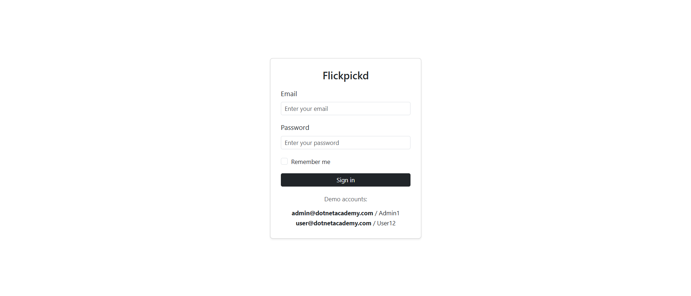
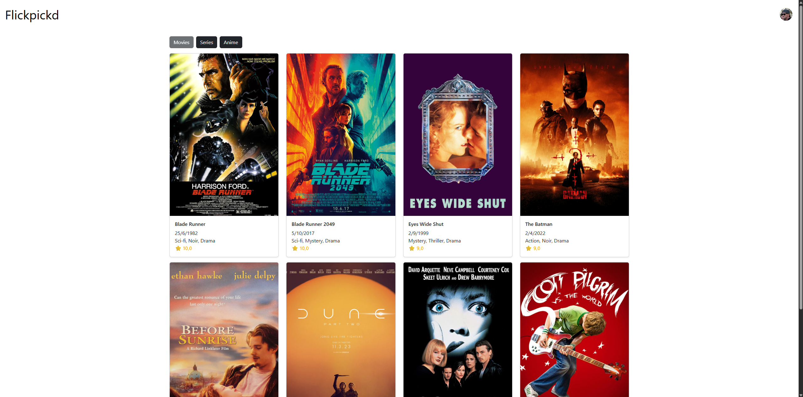
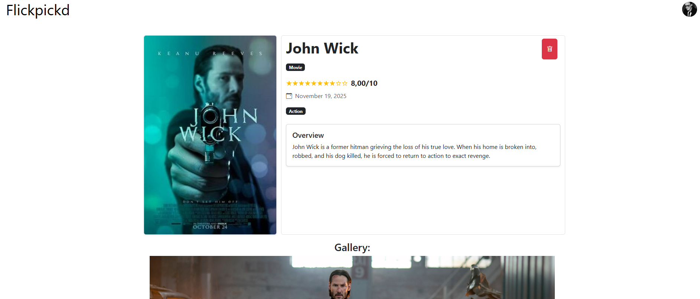
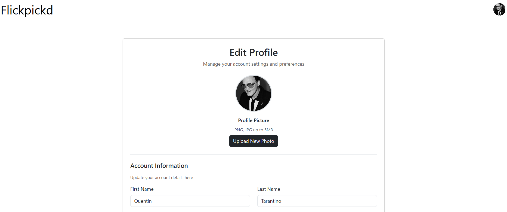

# DotNetAcademy: Flickpickd

A modern media catalog application built with .NET 9 and Blazor Server. Flickpickd allows users to catalog and manage their favorite movies, series, and anime in a rich, interactive web interface.

## 🚀 Features

- **Media Cataloging**: Add and manage movies, series, and anime
- **User Authentication**: Secure login system with ASP.NET Core Identity
- **User Profiles**: Customizable user profiles
- **Responsive Design**: Modern, mobile-friendly Bootstrap interface
- **Filtering**: Filter content by media type (Movies, Series, Anime)

## Screenshots

### Login Page


### Item List



### Item Details


### Edit Profile


## 🛠 Tech Stack

- **.NET 9** - Latest .NET framework
- **Blazor Server** - Interactive server-side rendering
- **Entity Framework Core 9.0.10** - Object-relational mapping
- **ASP.NET Core Identity** - Authentication and user management
- **SQL Server** - Database (Dockerized)
- **Bootstrap** - UI framework
- **N-tier Architecture** - Multi-project solution structure

## 🚦 Prerequisites

- [.NET 9 SDK](https://dotnet.microsoft.com/download/dotnet/9.0)
- [Docker Desktop](https://www.docker.com/products/docker-desktop) (for SQL Server)
- [Visual Studio 2022](https://visualstudio.microsoft.com/) or [Visual Studio Code](https://code.visualstudio.com/)

## 🔧 Setup Instructions

### 1. Clone the Repository

```bash
git clone https://github.com/Teristsan/dotnet-academy.git
cd dotnet-academy
```

### 2. Start SQL Server with Docker

Run the following Docker command to start a SQL Server instance:

```bash
docker run -e "ACCEPT_EULA=Y" -e "SA_PASSWORD=Picka123!" \
  -p 1436:1433 --name sqlserver-dev \
  -d mcr.microsoft.com/mssql/server:2022-latest
```

### 3. Restore Packages
  **For VS Code**
  ```bash
  dotnet restore
  ```

  **For Visual Studio**\
  Build the project and the dependencies will be automatically restored.

### 4. Update Database

Run the Entity Framework migrations to create the database:\
**For VS Code**
```bash
dotnet ef database update --project DotNetAcademy.Persistence --startup-project DotNetAcademy
```

**For Visual Studio**
- Go to: Tools -> NuGet Package Manager -> Package Manager Console
- Select **DotNetAcademy.Persistence**(or the porject in which you Db Context will exist in) as default project and run:
```bash
Update-Database
```

### 5. Run the Application
**For VS Code**
```bash
dotnet run --project DotNetAcademy
```
**For Visual Studio**
- Press the non-filled green play button to run the project without the debugger enabled.
- Press the filled green play button to run the project with the debugger enabled.

The application will be available at `https://localhost:7021` 

## 👥 Authentication

The application uses **ASP.NET Core Identity** for user authentication and authorization, providing:

- **User Registration**: Create new accounts with email verification
- **Secure Login**: Password-based authentication with security features
- **Role Management**: Admin and User roles with different permissions
- **Profile Management**: Users can update their profiles and upload profile pictures
- **Password Security**: Built-in password hashing and security policies

### Default User Accounts

The application comes with pre-seeded user accounts for testing:

#### Administrator Account
- **Email**: `admin@dotnetacademy.com`
- **Password**: Admin1
- **Role**: Admin

#### Regular User Account
- **Email**: `user@dotnetacademy.com`
- **Password**: User12
- **Role**: User

## 🏗 Architecture

The application follows N-tier Architecture principles:

- **Presentation Layer**: `DotNetAcademy` - Blazor Server components and pages
- **Business Logic**: `DotNetAcademy.Services` - Application services
- **Data Access**: `DotNetAcademy.Persistence` - EF Core, repositories, and entities

## Basic concepts presentation
[.NET Academy presentation](assets/DotNetAcademy.pptx)


